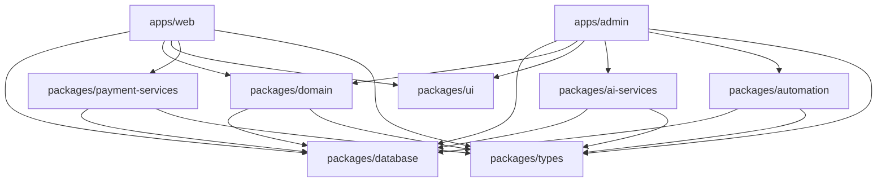

# 🚀 BandAuto Turborepo 마이그레이션 가이드

> **작성일**: 2025-11-19
> **프로젝트**: BandAuto v1.2.0
> **목적**: 기존 Next.js 모놀리식 구조를 Turborepo 모노레포로 전환

---

## 📋 목차

1. [현재 프로젝트 상태 분석](#1-현재-프로젝트-상태-분석)
2. [Turborepo 마이그레이션 목표 구조](#2-turborepo-마이그레이션-목표-구조)
3. [단계별 마이그레이션 지침](#3-단계별-마이그레이션-지침)
4. [AI에게 작업 지시하는 방법](#4-ai에게-작업-지시하는-방법)
5. [검증 및 테스트](#5-검증-및-테스트)
6. [주의사항 및 체크리스트](#6-주의사항-및-체크리스트)

---

## 1. 현재 프로젝트 상태 분석

### 1.1 기술 스택

```json
{
  "framework": "Next.js 14.2.3 (App Router)",
  "runtime": "Node.js 20.x",
  "database": "SQLite + Prisma ORM 6.19.0",
  "ui": "React 18.2 + Tailwind CSS 3.4",
  "auth": "NextAuth.js 4.24.6",
  "ai": "Google Gemini API 0.24.1",
  "payment": "토스페이먼츠 SDK",
  "automation": "Playwright 1.55.0",
  "state": "Zustand 4.5.0",
  "validation": "Zod 3.22.4 + React Hook Form 7.49.0"
}
```

### 1.2 현재 프로젝트 구조

```
bandauto/
├── src/
│   ├── app/                    # Next.js App Router (페이지 + API Routes)
│   │   ├── (auth)/            # 인증 페이지 그룹
│   │   ├── (admin)/           # 관리자 대시보드 그룹
│   │   ├── store/             # 고객용 쇼핑몰
│   │   ├── dashboard/         # 사용자 대시보드
│   │   ├── api/               # 🔴 백엔드 API 엔드포인트
│   │   │   ├── auth/
│   │   │   ├── payments/
│   │   │   ├── products/
│   │   │   ├── shop/
│   │   │   ├── wholesale/
│   │   │   ├── retail/
│   │   │   ├── aliexpress/
│   │   │   └── settings/
│   │   └── ...
│   ├── components/            # React 컴포넌트
│   │   ├── ui/               # 재사용 가능한 UI 컴포넌트
│   │   ├── layout/           # 레이아웃 컴포넌트
│   │   └── providers/        # Context Providers
│   ├── lib/                   # 핵심 라이브러리 & 비즈니스 로직
│   │   ├── database/         # Prisma 클라이언트
│   │   ├── http/             # HTTP 클라이언트
│   │   ├── errors/           # 에러 핸들러
│   │   ├── helpers/          # 헬퍼 함수
│   │   └── utils/            # 유틸리티
│   ├── domain/                # 🔴 도메인 로직 (DDD 아키텍처)
│   │   ├── auth/             # 인증 도메인
│   │   ├── products/         # 상품 도메인
│   │   ├── payments/         # 결제 도메인
│   │   ├── cart/             # 장바구니 도메인
│   │   ├── orders/           # 주문 도메인
│   │   ├── customers/        # 고객 도메인
│   │   ├── wholesale/        # 도매 도메인
│   │   ├── retail/           # 소매 도메인
│   │   ├── aliexpress/       # AliExpress 도메인
│   │   ├── band/             # Band API 도메인
│   │   └── pricing/          # 가격정책 도메인
│   ├── types/                 # TypeScript 타입 정의
│   │   └── services/         # 서비스별 타입
│   ├── stores/                # Zustand 상태 관리
│   └── styles/                # 전역 스타일
├── prisma/
│   ├── schema.prisma          # 🔴 20개 모델 (459 lines)
│   ├── seed.ts               # 시드 데이터
│   └── dev.db                # SQLite 개발 DB
├── docs/                      # 개발 문서
│   ├── frontend/             # 프론트엔드 가이드
│   └── backend/              # 백엔드 가이드
├── package.json               # 의존성 관리 (2,512 bytes)
├── tsconfig.json             # TypeScript 설정
├── next.config.js            # Next.js 설정
├── tailwind.config.ts        # Tailwind CSS 설정
├── .env.local                # 환경 변수
├── CLAUDE.md                 # 프로젝트 가이드 (25KB)
└── README.md                 # 프로젝트 개요
```

### 1.3 핵심 의존성 분석

#### A. 프론트엔드 전용 패키지
```json
{
  "react": "^18.2.0",
  "react-dom": "^18.2.0",
  "react-hook-form": "^7.49.0",
  "zustand": "^4.5.0",
  "lucide-react": "^0.321.0",
  "zod": "^3.22.4"
}
```

#### B. 백엔드 전용 패키지
```json
{
  "@prisma/client": "^6.19.0",
  "@google/generative-ai": "^0.24.1",
  "bcryptjs": "^2.4.3",
  "bull": "^4.16.5",
  "crypto-js": "^4.2.0",
  "nodemailer": "^6.9.9",
  "redis": "^4.6.12",
  "exceljs": "^4.4.0",
  "xlsx": "^0.18.5"
}
```

#### C. 공통/통합 패키지
```json
{
  "next": "14.2.3",
  "next-auth": "^4.24.6",
  "@next-auth/prisma-adapter": "^1.0.7",
  "@tosspayments/payment-sdk": "^1.9.1",
  "@tosspayments/payment-widget-sdk": "^0.12.0",
  "dotenv": "^17.2.1",
  "playwright": "^1.55.0",
  "uuid": "^12.0.0"
}
```

### 1.4 주요 기능 모듈

| 모듈 | 설명 | 현재 위치 | 타입 |
|------|------|-----------|------|
| **인증** | NextAuth.js 기반 인증 | `src/app/api/auth` | API |
| **AI 분석** | Gemini AI 상품 분석 (873라인) | `src/lib/gemini-ai.ts` | 라이브러리 |
| **결제** | 토스페이먼츠 통합 | `src/domain/payments` | 도메인 |
| **장바구니** | 세션 기반 장바구니 | `src/domain/cart` | 도메인 |
| **도매수집** | Playwright 크롤링 | `src/domain/wholesale` | 도메인 |
| **소매자동화** | Band API 포스팅 | `src/domain/retail` | 도메인 |
| **상품관리** | 상품 CRUD + 이미지 | `src/domain/products` | 도메인 |
| **주문관리** | 주문 처리 + 배송 | `src/domain/orders` | 도메인 |

### 1.5 데이터베이스 스키마 (20개 모델)

```prisma
// 핵심 시스템 (5개)
- User                 (32 fields) - 사용자 및 Band API 연동
- Customer             (8 fields)  - 고객 정보
- CustomerAddress      (11 fields) - 배송지 관리
- Product              (29 fields) - 상품 정보
- ProductCategory      (9 fields)  - 상품 카테고리
- ProductImage         (7 fields)  - 상품 이미지

// 주문/결제 시스템 (6개)
- Order                (17 fields) - 주문 정보
- OrderItem            (7 fields)  - 주문 아이템
- Payment              (13 fields) - 결제 정보
- PaymentMethod        (6 fields)  - 결제 수단
- Refund               (9 fields)  - 환불 관리
- Cart                 (6 fields)  - 장바구니
- CartItem             (7 fields)  - 장바구니 아이템

// 도매/소매 시스템 (7개)
- WholesaleBand        (10 fields) - 도매밴드 (가격정책 포함)
- CollectedPost        (26 fields) - 수집 게시물 + AI 분석
- PostImage            (5 fields)  - 게시물 이미지
- RetailBand           (8 fields)  - 소매밴드
- RetailSettings       (13 fields) - 소매밴드 설정
- RetailPost           (16 fields) - 소매 게시물
- RetailPostImage      (5 fields)  - 소매 게시물 이미지
- SourcingSite         (15 fields) - 소싱 사이트

// AliExpress 시스템 (4개)
- AliExpressSourcing   (13 fields) - AliExpress 소싱 설정
- AliExpressProduct    (25 fields) - AliExpress 상품
- AliExpressProductImage (5 fields)
- AliExpressProductReview (5 fields)

// 쇼핑몰 시스템 (3개)
- Shop                 (8 fields)  - 쇼핑몰 정보
- ShopProduct          (21 fields) - 쇼핑몰 상품
- ShopSettings         (17 fields) - 쇼핑몰 설정

// API 설정 시스템 (3개)
- BandApiSettings      (8 fields)  - Band API 설정
- GeminiApiSettings    (7 fields)  - Gemini API 설정
- AutomationSettings   (4 fields)  - 자동화 설정
```

### 1.6 환경 변수

```bash
# 데이터베이스
DATABASE_URL="file:./dev.db"

# 인증
NEXTAUTH_URL="http://localhost:3000"
NEXTAUTH_SECRET="[SECRET]"

# AI 서비스
GEMINI_API_KEY="[API_KEY]"

# Band API
BAND_CLIENT_ID="[CLIENT_ID]"
BAND_CLIENT_SECRET="[CLIENT_SECRET]"

# 토스페이먼츠 (현재 미설정)
TOSS_PAYMENTS_CLIENT_KEY="test_ck_..."
TOSS_PAYMENTS_SECRET_KEY="test_sk_..."
TOSS_PAYMENTS_WEBHOOK_SECRET="..."

# 쇼핑몰 설정
FREE_SHIPPING_AMOUNT="30000"
DEFAULT_SHIPPING_FEE="3000"
SHOP_ADMIN_EMAIL="admin@example.com"

# Redis (옵션)
REDIS_URL="redis://localhost:6379"
```

---

## 2. Turborepo 마이그레이션 목표 구조

### 2.1 최종 모노레포 구조

```
bandauto-monorepo/
├── apps/
│   ├── web/                          # 🌐 고객용 쇼핑몰 (Next.js)
│   │   ├── src/
│   │   │   ├── app/
│   │   │   │   ├── (shop)/          # 쇼핑몰 페이지
│   │   │   │   │   ├── page.tsx     # 메인 페이지
│   │   │   │   │   ├── products/    # 상품 목록/상세
│   │   │   │   │   ├── cart/        # 장바구니
│   │   │   │   │   └── checkout/    # 주문서
│   │   │   │   └── api/             # 고객용 API (결제, 장바구니)
│   │   │   ├── components/          # 쇼핑몰 컴포넌트
│   │   │   └── styles/
│   │   ├── package.json
│   │   └── tsconfig.json
│   │
│   ├── admin/                        # 🔧 관리자 대시보드 (Next.js)
│   │   ├── src/
│   │   │   ├── app/
│   │   │   │   ├── (dashboard)/     # 대시보드 페이지
│   │   │   │   │   ├── wholesale/   # 도매 관리
│   │   │   │   │   ├── products/    # 상품 관리
│   │   │   │   │   ├── orders/      # 주문 관리
│   │   │   │   │   ├── shop/        # 쇼핑몰 관리
│   │   │   │   │   └── settings/    # 설정
│   │   │   │   └── api/             # 관리자 API
│   │   │   ├── components/
│   │   │   └── styles/
│   │   ├── package.json
│   │   └── tsconfig.json
│   │
│   └── docs/                         # 📚 문서 사이트 (Nextra/Docusaurus)
│       ├── pages/
│       ├── package.json
│       └── tsconfig.json
│
├── packages/
│   ├── database/                     # 🗄️ Prisma Database 패키지
│   │   ├── prisma/
│   │   │   ├── schema.prisma        # 20개 모델
│   │   │   └── seed.ts
│   │   ├── src/
│   │   │   ├── index.ts             # export { prisma }
│   │   │   └── client.ts
│   │   ├── package.json
│   │   └── tsconfig.json
│   │
│   ├── domain/                       # 🏢 비즈니스 로직 (DDD)
│   │   ├── src/
│   │   │   ├── auth/                # 인증 도메인
│   │   │   ├── products/            # 상품 도메인
│   │   │   ├── payments/            # 결제 도메인
│   │   │   ├── cart/                # 장바구니 도메인
│   │   │   ├── orders/              # 주문 도메인
│   │   │   ├── customers/           # 고객 도메인
│   │   │   ├── wholesale/           # 도매 도메인
│   │   │   ├── retail/              # 소매 도메인
│   │   │   ├── aliexpress/          # AliExpress 도메인
│   │   │   ├── pricing/             # 가격정책 도메인
│   │   │   └── index.ts
│   │   ├── package.json
│   │   └── tsconfig.json
│   │
│   ├── ai-services/                  # 🤖 AI 서비스 (Gemini)
│   │   ├── src/
│   │   │   ├── gemini-ai.ts         # 873라인 AI 분석
│   │   │   ├── analysis/            # 상품 분석
│   │   │   ├── pricing/             # 가격정책 적용
│   │   │   └── index.ts
│   │   ├── package.json
│   │   └── tsconfig.json
│   │
│   ├── payment-services/             # 💳 결제 서비스
│   │   ├── src/
│   │   │   ├── toss-payments.ts     # 토스페이먼츠
│   │   │   ├── webhook-handler.ts   # 웹훅 처리
│   │   │   └── index.ts
│   │   ├── package.json
│   │   └── tsconfig.json
│   │
│   ├── automation/                   # ⚙️ 자동화 시스템
│   │   ├── src/
│   │   │   ├── band-crawler.ts      # Playwright 크롤링
│   │   │   ├── retail-poster.ts     # 소매밴드 포스팅
│   │   │   └── index.ts
│   │   ├── package.json
│   │   └── tsconfig.json
│   │
│   ├── ui/                           # 🎨 공통 UI 컴포넌트
│   │   ├── src/
│   │   │   ├── components/
│   │   │   │   ├── Button.tsx
│   │   │   │   ├── Input.tsx
│   │   │   │   ├── Card.tsx
│   │   │   │   └── ...
│   │   │   ├── styles/
│   │   │   └── index.ts
│   │   ├── package.json
│   │   ├── tsconfig.json
│   │   └── tailwind.config.ts
│   │
│   ├── typescript-config/            # 🔧 공통 TypeScript 설정
│   │   ├── base.json
│   │   ├── nextjs.json
│   │   └── react-library.json
│   │
│   ├── eslint-config/                # 📏 공통 ESLint 설정
│   │   ├── index.js
│   │   └── package.json
│   │
│   └── types/                        # 📝 공통 타입 정의
│       ├── src/
│       │   ├── api/
│       │   ├── domain/
│       │   └── index.ts
│       ├── package.json
│       └── tsconfig.json
│
├── turbo.json                        # Turborepo 설정
├── package.json                      # 루트 package.json
├── pnpm-workspace.yaml               # pnpm 워크스페이스 설정
└── .env.example                      # 환경 변수 예시
```

### 2.2 패키지 의존성 관계



### 2.3 각 패키지별 역할

| 패키지 | 타입 | 역할 | 주요 의존성 |
|--------|------|------|-------------|
| `apps/web` | Next.js App | 고객용 쇼핑몰 | React, Next.js, UI, Domain |
| `apps/admin` | Next.js App | 관리자 대시보드 | React, Next.js, UI, Domain, AI |
| `apps/docs` | Docs Site | 개발 문서 | Nextra/Docusaurus |
| `packages/database` | Library | Prisma DB 클라이언트 | Prisma, SQLite |
| `packages/domain` | Library | 비즈니스 로직 | Database, Types |
| `packages/ai-services` | Library | AI 분석 서비스 | Gemini API, Types |
| `packages/payment-services` | Library | 결제 서비스 | Toss SDK, Types |
| `packages/automation` | Library | 자동화 시스템 | Playwright, Database |
| `packages/ui` | React Library | 공통 UI | React, Tailwind |
| `packages/types` | Library | 공통 타입 | TypeScript |

---

## 3. 단계별 마이그레이션 지침

### Phase 1: 프로젝트 초기 설정 (1일)

#### Step 1.1: Turborepo 초기화

```bash
# 1. 새 디렉토리 생성
mkdir bandauto-monorepo
cd bandauto-monorepo

# 2. Turborepo 초기화
npx create-turbo@latest

# 또는 수동으로
npm init -y
npm install turbo --save-dev

# 3. pnpm 워크스페이스 설정
echo "packages:\n  - 'apps/*'\n  - 'packages/*'" > pnpm-workspace.yaml
```

#### Step 1.2: 루트 설정 파일 생성

**`turbo.json` 생성:**
```json
{
  "$schema": "https://turbo.build/schema.json",
  "globalDependencies": [".env", "tsconfig.json"],
  "pipeline": {
    "build": {
      "dependsOn": ["^build"],
      "outputs": [".next/**", "!.next/cache/**", "dist/**"]
    },
    "dev": {
      "cache": false,
      "persistent": true
    },
    "lint": {
      "dependsOn": ["^lint"]
    },
    "test": {
      "dependsOn": ["^build"],
      "outputs": ["coverage/**"]
    },
    "db:generate": {
      "cache": false
    },
    "db:push": {
      "cache": false
    }
  }
}
```

**루트 `package.json`:**
```json
{
  "name": "bandauto-monorepo",
  "version": "2.0.0",
  "private": true,
  "workspaces": [
    "apps/*",
    "packages/*"
  ],
  "scripts": {
    "dev": "turbo run dev",
    "build": "turbo run build",
    "lint": "turbo run lint",
    "test": "turbo run test",
    "clean": "turbo run clean && rm -rf node_modules",
    "db:generate": "turbo run db:generate",
    "db:push": "turbo run db:push"
  },
  "devDependencies": {
    "turbo": "latest",
    "prettier": "^3.2.0"
  },
  "packageManager": "pnpm@8.15.0"
}
```

---

### Phase 2: 공통 패키지 생성 (2일)

#### Step 2.1: `packages/database` 생성

```bash
mkdir -p packages/database/src
cd packages/database
npm init -y
```

**`packages/database/package.json`:**
```json
{
  "name": "@bandauto/database",
  "version": "1.0.0",
  "main": "./src/index.ts",
  "types": "./src/index.ts",
  "scripts": {
    "db:generate": "prisma generate",
    "db:push": "prisma db push",
    "db:studio": "prisma studio"
  },
  "dependencies": {
    "@prisma/client": "^6.19.0"
  },
  "devDependencies": {
    "prisma": "^6.19.0",
    "typescript": "^5.9.2"
  }
}
```

**작업 내용:**
1. 기존 `prisma/schema.prisma` 복사
2. `prisma/seed.ts` 복사
3. `src/client.ts` 생성 (Prisma Client 싱글톤)
4. `src/index.ts` 생성 (export)

**마이그레이션할 파일:**
- ✅ `prisma/schema.prisma` → `packages/database/prisma/schema.prisma`
- ✅ `prisma/seed.ts` → `packages/database/prisma/seed.ts`

#### Step 2.2: `packages/types` 생성

```bash
mkdir -p packages/types/src
```

**`packages/types/package.json`:**
```json
{
  "name": "@bandauto/types",
  "version": "1.0.0",
  "main": "./src/index.ts",
  "types": "./src/index.ts",
  "dependencies": {
    "zod": "^3.22.4"
  },
  "devDependencies": {
    "typescript": "^5.9.2"
  }
}
```

**마이그레이션할 파일:**
- ✅ `src/types/**/*` → `packages/types/src/`

#### Step 2.3: `packages/ui` 생성

```bash
mkdir -p packages/ui/src/components
```

**`packages/ui/package.json`:**
```json
{
  "name": "@bandauto/ui",
  "version": "1.0.0",
  "main": "./src/index.tsx",
  "types": "./src/index.tsx",
  "dependencies": {
    "react": "^18.2.0",
    "lucide-react": "^0.321.0"
  },
  "devDependencies": {
    "@types/react": "^18.2.0",
    "tailwindcss": "^3.4.1",
    "typescript": "^5.9.2"
  }
}
```

**마이그레이션할 파일:**
- ✅ `src/components/ui/**/*` → `packages/ui/src/components/`

#### Step 2.4: `packages/domain` 생성

**`packages/domain/package.json`:**
```json
{
  "name": "@bandauto/domain",
  "version": "1.0.0",
  "main": "./src/index.ts",
  "types": "./src/index.ts",
  "dependencies": {
    "@bandauto/database": "workspace:*",
    "@bandauto/types": "workspace:*"
  },
  "devDependencies": {
    "typescript": "^5.9.2"
  }
}
```

**마이그레이션할 파일:**
- ✅ `src/domain/**/*` → `packages/domain/src/`

---

### Phase 3: 전문 서비스 패키지 생성 (2일)

#### Step 3.1: `packages/ai-services` 생성

**`packages/ai-services/package.json`:**
```json
{
  "name": "@bandauto/ai-services",
  "version": "1.0.0",
  "main": "./src/index.ts",
  "types": "./src/index.ts",
  "dependencies": {
    "@google/generative-ai": "^0.24.1",
    "@bandauto/database": "workspace:*",
    "@bandauto/types": "workspace:*"
  },
  "devDependencies": {
    "typescript": "^5.9.2"
  }
}
```

**마이그레이션할 파일:**
- ✅ `src/lib/gemini-ai.ts` → `packages/ai-services/src/gemini-ai.ts`

#### Step 3.2: `packages/payment-services` 생성

**`packages/payment-services/package.json`:**
```json
{
  "name": "@bandauto/payment-services",
  "version": "1.0.0",
  "main": "./src/index.ts",
  "types": "./src/index.ts",
  "dependencies": {
    "@tosspayments/payment-sdk": "^1.9.1",
    "@tosspayments/payment-widget-sdk": "^0.12.0",
    "@bandauto/database": "workspace:*",
    "@bandauto/types": "workspace:*"
  },
  "devDependencies": {
    "typescript": "^5.9.2"
  }
}
```

**마이그레이션할 파일:**
- ✅ `src/domain/payments/*` → `packages/payment-services/src/`

#### Step 3.3: `packages/automation` 생성

**`packages/automation/package.json`:**
```json
{
  "name": "@bandauto/automation",
  "version": "1.0.0",
  "main": "./src/index.ts",
  "types": "./src/index.ts",
  "dependencies": {
    "playwright": "^1.55.0",
    "@bandauto/database": "workspace:*",
    "@bandauto/types": "workspace:*"
  },
  "devDependencies": {
    "@playwright/test": "^1.55.0",
    "typescript": "^5.9.2"
  }
}
```

**마이그레이션할 파일:**
- ✅ `src/domain/wholesale/crawler.ts` → `packages/automation/src/`
- ✅ `src/domain/retail/poster.ts` → `packages/automation/src/`

---

### Phase 4: 애플리케이션 생성 (3일)

#### Step 4.1: `apps/web` 생성 (고객용 쇼핑몰)

```bash
cd apps
npx create-next-app@14 web --typescript --tailwind --app --no-src-dir
cd web
```

**`apps/web/package.json`:**
```json
{
  "name": "web",
  "version": "2.0.0",
  "private": true,
  "scripts": {
    "dev": "next dev --port 3000",
    "build": "next build",
    "start": "next start",
    "lint": "next lint"
  },
  "dependencies": {
    "next": "14.2.3",
    "react": "^18.2.0",
    "react-dom": "^18.2.0",
    "@bandauto/database": "workspace:*",
    "@bandauto/domain": "workspace:*",
    "@bandauto/ui": "workspace:*",
    "@bandauto/payment-services": "workspace:*",
    "@bandauto/types": "workspace:*",
    "next-auth": "^4.24.6"
  },
  "devDependencies": {
    "@types/node": "^20.19.11",
    "@types/react": "^18.2.0",
    "typescript": "^5.9.2",
    "tailwindcss": "^3.4.1"
  }
}
```

**마이그레이션할 파일:**
- ✅ `src/app/store/**/*` → `apps/web/app/(shop)/`
- ✅ `src/app/api/payments/**/*` → `apps/web/app/api/payments/`
- ✅ `src/components/shop/**/*` → `apps/web/components/`

#### Step 4.2: `apps/admin` 생성 (관리자 대시보드)

```bash
npx create-next-app@14 admin --typescript --tailwind --app --no-src-dir
cd admin
```

**`apps/admin/package.json`:**
```json
{
  "name": "admin",
  "version": "2.0.0",
  "private": true,
  "scripts": {
    "dev": "next dev --port 3001",
    "build": "next build",
    "start": "next start",
    "lint": "next lint"
  },
  "dependencies": {
    "next": "14.2.3",
    "react": "^18.2.0",
    "react-dom": "^18.2.0",
    "@bandauto/database": "workspace:*",
    "@bandauto/domain": "workspace:*",
    "@bandauto/ui": "workspace:*",
    "@bandauto/ai-services": "workspace:*",
    "@bandauto/automation": "workspace:*",
    "@bandauto/types": "workspace:*",
    "next-auth": "^4.24.6"
  },
  "devDependencies": {
    "@types/node": "^20.19.11",
    "@types/react": "^18.2.0",
    "typescript": "^5.9.2",
    "tailwindcss": "^3.4.1"
  }
}
```

**마이그레이션할 파일:**
- ✅ `src/app/(admin)/**/*` → `apps/admin/app/(dashboard)/`
- ✅ `src/app/api/wholesale/**/*` → `apps/admin/app/api/wholesale/`
- ✅ `src/app/api/retail/**/*` → `apps/admin/app/api/retail/`
- ✅ `src/app/api/products/**/*` → `apps/admin/app/api/products/`
- ✅ `src/app/api/settings/**/*` → `apps/admin/app/api/settings/`
- ✅ `src/components/admin/**/*` → `apps/admin/components/`

---

### Phase 5: 환경 변수 및 설정 마이그레이션 (1일)

#### Step 5.1: 환경 변수 분리

**루트 `.env.example`:**
```bash
# Database (모든 앱 공통)
DATABASE_URL="file:./dev.db"

# Auth (모든 앱 공통)
NEXTAUTH_URL="http://localhost:3000"
NEXTAUTH_SECRET="[SECRET]"

# AI Services (Admin만 사용)
GEMINI_API_KEY="[API_KEY]"

# Band API (Admin만 사용)
BAND_CLIENT_ID="[CLIENT_ID]"
BAND_CLIENT_SECRET="[CLIENT_SECRET]"

# 토스페이먼츠 (Web, Admin 둘 다 사용)
TOSS_PAYMENTS_CLIENT_KEY="test_ck_..."
TOSS_PAYMENTS_SECRET_KEY="test_sk_..."
```

**`apps/web/.env.local`:**
```bash
DATABASE_URL="file:../../packages/database/prisma/dev.db"
NEXTAUTH_URL="http://localhost:3000"
NEXTAUTH_SECRET="[SECRET]"
TOSS_PAYMENTS_CLIENT_KEY="test_ck_..."
```

**`apps/admin/.env.local`:**
```bash
DATABASE_URL="file:../../packages/database/prisma/dev.db"
NEXTAUTH_URL="http://localhost:3001"
NEXTAUTH_SECRET="[SECRET]"
GEMINI_API_KEY="[API_KEY]"
BAND_CLIENT_ID="[CLIENT_ID]"
BAND_CLIENT_SECRET="[CLIENT_SECRET]"
TOSS_PAYMENTS_SECRET_KEY="test_sk_..."
```

#### Step 5.2: TypeScript 설정 공유

**`packages/typescript-config/base.json`:**
```json
{
  "compilerOptions": {
    "target": "ES2020",
    "lib": ["ES2020"],
    "module": "ESNext",
    "moduleResolution": "bundler",
    "strict": true,
    "skipLibCheck": true,
    "esModuleInterop": true,
    "resolveJsonModule": true,
    "isolatedModules": true,
    "declaration": true,
    "declarationMap": true
  }
}
```

**`packages/typescript-config/nextjs.json`:**
```json
{
  "extends": "./base.json",
  "compilerOptions": {
    "target": "ES2020",
    "lib": ["dom", "dom.iterable", "esnext"],
    "jsx": "preserve",
    "incremental": true,
    "plugins": [{ "name": "next" }]
  },
  "include": ["next-env.d.ts", "**/*.ts", "**/*.tsx", ".next/types/**/*.ts"],
  "exclude": ["node_modules"]
}
```

---

## 4. AI에게 작업 지시하는 방법

### 4.1 전체 마이그레이션 프롬프트

```markdown
# BandAuto Turborepo 마이그레이션 작업

## 현재 상황
- Next.js 14 모놀리식 구조로 되어 있음
- 프로젝트 루트: `/Users/seok/develop/source/bandauto`
- 주요 디렉토리: `src/app`, `src/components`, `src/lib`, `src/domain`, `prisma`
- 20개 Prisma 모델, 873라인 AI 서비스, 다양한 도메인 로직 포함

## 목표
현재 프로젝트를 Turborepo 모노레포 구조로 전환하여:
1. 고객용 쇼핑몰 (`apps/web`)
2. 관리자 대시보드 (`apps/admin`)
3. 공통 패키지들 (`packages/*`)

로 분리하고자 합니다.

## 요청 사항

### Phase 1: 초기 설정
1. 새 디렉토리 `bandauto-monorepo` 생성
2. Turborepo 초기화 및 `turbo.json` 설정
3. `pnpm-workspace.yaml` 생성
4. 루트 `package.json` 설정

**중요**: 아래 정확한 구조를 따를 것
- `apps/web` - 고객용 쇼핑몰 (포트 3000)
- `apps/admin` - 관리자 대시보드 (포트 3001)
- `packages/database` - Prisma 클라이언트
- `packages/domain` - 비즈니스 로직
- `packages/ui` - 공통 UI 컴포넌트
- `packages/types` - 공통 타입 정의
- `packages/ai-services` - Gemini AI 서비스
- `packages/payment-services` - 토스페이먼츠
- `packages/automation` - Playwright 자동화

### Phase 2: 데이터베이스 패키지 생성
1. `packages/database` 디렉토리 생성
2. 기존 `prisma/schema.prisma` (20개 모델, 844라인) 복사
3. `@bandauto/database` 패키지 설정
4. Prisma Client 싱글톤 패턴 구현

**마이그레이션 파일:**
- ✅ `prisma/schema.prisma` → `packages/database/prisma/schema.prisma`
- ✅ `prisma/seed.ts` → `packages/database/prisma/seed.ts`

### Phase 3: 공통 라이브러리 패키지 생성
1. `packages/types` - 기존 `src/types/**/*` 마이그레이션
2. `packages/ui` - 기존 `src/components/ui/**/*` 마이그레이션
3. `packages/domain` - 기존 `src/domain/**/*` 마이그레이션 (11개 도메인)

**주의**: 각 패키지는 `workspace:*` 프로토콜로 내부 의존성 관리

### Phase 4: 전문 서비스 패키지 생성
1. `packages/ai-services` - 기존 `src/lib/gemini-ai.ts` (873라인) 마이그레이션
2. `packages/payment-services` - 결제 서비스 로직 분리
3. `packages/automation` - Playwright 크롤링 & 포스팅 자동화

### Phase 5: 애플리케이션 생성
1. `apps/web` (고객용 쇼핑몰)
   - 기존 `src/app/store/**/*` 마이그레이션
   - 결제 API 엔드포인트 포함

2. `apps/admin` (관리자 대시보드)
   - 기존 `src/app/(admin)/**/*` 마이그레이션
   - 도매/소매/상품/설정 API 포함

### Phase 6: 환경 변수 및 설정
1. 루트 `.env.example` 생성
2. 각 앱별 `.env.local` 분리
3. TypeScript 공통 설정 (`packages/typescript-config`)
4. ESLint 공통 설정 (`packages/eslint-config`)

## 제약 조건
- **절대로 기존 코드를 삭제하지 말 것** (복사만 수행)
- **모든 20개 Prisma 모델을 그대로 유지**
- **873라인 Gemini AI 코드 완전 보존**
- **환경 변수 민감 정보는 `.env.example`에 플레이스홀더만**
- **패키지 간 순환 의존성 방지**

## 검증 방법
작업 완료 후:
1. `pnpm install` 성공
2. `pnpm db:generate` 성공
3. `pnpm dev` - 모든 앱 동시 실행
4. `apps/web` localhost:3000 접속 가능
5. `apps/admin` localhost:3001 접속 가능

## 우선순위
1순위: Phase 1-2 (Turborepo 초기화 + Database 패키지)
2순위: Phase 3-4 (공통 패키지 + 전문 서비스)
3순위: Phase 5-6 (애플리케이션 + 설정)

**시작해주세요!**
```

### 4.2 단계별 세부 프롬프트

#### 프롬프트 1: Turborepo 초기화

```markdown
# Phase 1: Turborepo 초기화

현재 디렉토리: `/Users/seok/develop/source/bandauto`

## 작업
1. 상위 디렉토리에 `bandauto-monorepo` 생성
2. Turborepo 초기화 (`pnpm` 사용)
3. `turbo.json` 생성 - 다음 파이프라인 포함:
   - build (Next.js 빌드)
   - dev (개발 서버)
   - lint (ESLint)
   - test (Playwright)
   - db:generate (Prisma)
   - db:push (Prisma)
4. `pnpm-workspace.yaml` 생성 - `apps/*`, `packages/*` 워크스페이스
5. 루트 `package.json` 생성 - turbo 스크립트 포함

**중요**: 아무 파일도 복사하지 말고 구조만 생성
```

#### 프롬프트 2: Database 패키지 생성

```markdown
# Phase 2: Database 패키지 생성

## 작업
1. `packages/database` 디렉토리 생성
2. 다음 파일들을 복사:
   - `/Users/seok/develop/source/bandauto/prisma/schema.prisma`
     → `packages/database/prisma/schema.prisma`
   - `/Users/seok/develop/source/bandauto/prisma/seed.ts`
     → `packages/database/prisma/seed.ts`

3. `packages/database/package.json` 생성:
   - name: `@bandauto/database`
   - dependencies: `@prisma/client@^6.19.0`
   - devDependencies: `prisma@^6.19.0`
   - scripts: `db:generate`, `db:push`, `db:studio`

4. `packages/database/src/client.ts` 생성 - Prisma Client 싱글톤
5. `packages/database/src/index.ts` 생성 - export { prisma }

**검증**:
- `cd packages/database && pnpm db:generate` 성공해야 함
- 20개 모델 모두 정상 생성 확인
```

#### 프롬프트 3: 공통 패키지 생성

```markdown
# Phase 3: 공통 패키지 생성

## 작업 1: Types 패키지
1. `packages/types` 생성
2. 기존 `/Users/seok/develop/source/bandauto/src/types/**/*` 전체 복사
3. `package.json` 생성 - `@bandauto/types`, zod 의존성 포함
4. `src/index.ts` - 모든 타입 re-export

## 작업 2: UI 패키지
1. `packages/ui` 생성
2. 기존 `/Users/seok/develop/source/bandauto/src/components/ui/**/*` 복사
3. `package.json` - `@bandauto/ui`, React, lucide-react, Tailwind 포함
4. `tailwind.config.ts` 생성
5. `src/index.tsx` - 모든 컴포넌트 re-export

## 작업 3: Domain 패키지
1. `packages/domain` 생성
2. 기존 `/Users/seok/develop/source/bandauto/src/domain/**/*` 전체 복사
3. `package.json` - 내부 의존성:
   - `@bandauto/database: workspace:*`
   - `@bandauto/types: workspace:*`
4. import 경로 수정:
   - `@/lib/db` → `@bandauto/database`
   - `@/types/*` → `@bandauto/types`

**주의**: 순환 의존성 방지
```

#### 프롬프트 4: 전문 서비스 패키지

```markdown
# Phase 4: 전문 서비스 패키지

## 작업 1: AI Services
1. `packages/ai-services` 생성
2. 기존 `/Users/seok/develop/source/bandauto/src/lib/gemini-ai.ts` (873라인) 복사
3. `package.json`:
   - `@google/generative-ai@^0.24.1`
   - `@bandauto/database: workspace:*`
   - `@bandauto/types: workspace:*`
4. import 경로 수정

## 작업 2: Payment Services
1. `packages/payment-services` 생성
2. 기존 결제 로직 복사:
   - `src/domain/payments/*`
3. `package.json`:
   - `@tosspayments/payment-sdk@^1.9.1`
   - `@tosspayments/payment-widget-sdk@^0.12.0`
   - 내부 패키지 의존성

## 작업 3: Automation
1. `packages/automation` 생성
2. 자동화 로직 복사:
   - 도매 크롤링
   - 소매 포스팅
3. `package.json`:
   - `playwright@^1.55.0`
   - 내부 패키지 의존성

**검증**: 각 패키지 `pnpm build` 성공
```

#### 프롬프트 5: 애플리케이션 생성

```markdown
# Phase 5: 애플리케이션 생성

## 작업 1: apps/web (고객용 쇼핑몰)
1. Next.js 14 앱 생성 (포트 3000)
2. 다음 파일 마이그레이션:
   - `src/app/store/**/*` → `apps/web/app/(shop)/`
   - `src/app/api/payments/**/*` → `apps/web/app/api/payments/`
3. `package.json` 의존성:
   - `@bandauto/database`
   - `@bandauto/domain`
   - `@bandauto/ui`
   - `@bandauto/payment-services`
   - `@bandauto/types`
4. import 경로 전체 수정
5. `.env.local` 생성 (DATABASE_URL, NEXTAUTH, TOSS)

## 작업 2: apps/admin (관리자 대시보드)
1. Next.js 14 앱 생성 (포트 3001)
2. 다음 파일 마이그레이션:
   - `src/app/(admin)/**/*` → `apps/admin/app/(dashboard)/`
   - `src/app/api/wholesale/**/*` → `apps/admin/app/api/wholesale/`
   - `src/app/api/retail/**/*` → `apps/admin/app/api/retail/`
   - `src/app/api/products/**/*` → `apps/admin/app/api/products/`
   - `src/app/api/settings/**/*` → `apps/admin/app/api/settings/`
3. `package.json` 의존성:
   - 모든 `@bandauto/*` 패키지
4. import 경로 전체 수정
5. `.env.local` 생성 (모든 환경 변수)

**검증**:
- `pnpm dev` - 두 앱 동시 실행
- localhost:3000 - 쇼핑몰 접속
- localhost:3001 - 관리자 접속
```

#### 프롬프트 6: 최종 검증

```markdown
# Phase 6: 최종 검증 및 정리

## 작업
1. 루트 `.env.example` 생성 (민감 정보 제거)
2. 각 패키지 `README.md` 생성
3. `packages/typescript-config` 생성 (공통 tsconfig)
4. `packages/eslint-config` 생성 (공통 eslint)

## 검증 체크리스트
- [ ] `pnpm install` 성공
- [ ] `pnpm db:generate` 성공
- [ ] `pnpm build` 전체 성공
- [ ] `pnpm dev` 성공
- [ ] `apps/web` 접속 가능 (3000)
- [ ] `apps/admin` 접속 가능 (3001)
- [ ] 모든 패키지 타입 체크 통과
- [ ] 순환 의존성 없음
- [ ] 20개 Prisma 모델 정상
- [ ] 873라인 AI 코드 정상

## 문서화
1. 루트 `README.md` 업데이트
2. 마이그레이션 가이드 작성
3. 각 앱 개발 가이드 작성

**완료 보고**: 모든 체크리스트 통과 후 보고
```

---

## 5. 검증 및 테스트

### 5.1 단계별 검증

#### Phase 1 검증
```bash
cd bandauto-monorepo
pnpm install
turbo --version
```

#### Phase 2 검증
```bash
cd packages/database
pnpm db:generate
# 20개 모델 생성 확인
ls -la node_modules/.prisma/client
```

#### Phase 3 검증
```bash
cd packages/types
pnpm build

cd ../ui
pnpm build

cd ../domain
pnpm build
```

#### Phase 4 검증
```bash
cd packages/ai-services
pnpm build

cd ../payment-services
pnpm build

cd ../automation
pnpm build
```

#### Phase 5 검증
```bash
cd apps/web
pnpm dev  # localhost:3000

cd ../admin
pnpm dev  # localhost:3001
```

### 5.2 통합 테스트

```bash
# 루트에서
pnpm install
pnpm db:generate
pnpm build
pnpm dev
```

### 5.3 기능별 테스트 체크리스트

- [ ] **인증**: 로그인/로그아웃 정상 동작
- [ ] **AI 분석**: Gemini API 호출 정상
- [ ] **결제**: 토스페이먼츠 위젯 로드 정상
- [ ] **도매 수집**: Playwright 크롤링 정상
- [ ] **소매 포스팅**: Band API 포스팅 정상
- [ ] **상품 관리**: CRUD 작업 정상
- [ ] **주문 관리**: 주문 생성/조회 정상
- [ ] **장바구니**: 추가/삭제 정상

---

## 6. 주의사항 및 체크리스트

### 6.1 절대 금지 사항

❌ **기존 프로젝트 파일 삭제 금지**
  → 복사만 수행, 원본은 백업으로 보존

❌ **Prisma 스키마 수정 금지**
  → 20개 모델 그대로 유지

❌ **AI 서비스 코드 수정 금지**
  → 873라인 gemini-ai.ts 완전 보존

❌ **환경 변수 하드코딩 금지**
  → 민감 정보는 `.env` 파일만 사용

❌ **순환 의존성 생성 금지**
  → 패키지 간 의존성 방향 명확히

### 6.2 마이그레이션 체크리스트

#### Phase 1: 초기 설정
- [ ] Turborepo 설치 완료
- [ ] `turbo.json` 생성
- [ ] `pnpm-workspace.yaml` 생성
- [ ] 루트 `package.json` 설정
- [ ] 디렉토리 구조 생성 (`apps/`, `packages/`)

#### Phase 2: Database 패키지
- [ ] `packages/database` 생성
- [ ] `schema.prisma` 복사 (20개 모델 확인)
- [ ] `seed.ts` 복사
- [ ] Prisma Client 싱글톤 구현
- [ ] `pnpm db:generate` 성공

#### Phase 3: 공통 패키지
- [ ] `packages/types` 생성 및 타입 마이그레이션
- [ ] `packages/ui` 생성 및 컴포넌트 마이그레이션
- [ ] `packages/domain` 생성 및 도메인 로직 마이그레이션
- [ ] 내부 의존성 `workspace:*` 설정
- [ ] import 경로 수정 완료

#### Phase 4: 전문 서비스 패키지
- [ ] `packages/ai-services` 생성 (873라인 코드 보존)
- [ ] `packages/payment-services` 생성
- [ ] `packages/automation` 생성
- [ ] 각 패키지 `pnpm build` 성공

#### Phase 5: 애플리케이션
- [ ] `apps/web` 생성 (포트 3000)
- [ ] `apps/admin` 생성 (포트 3001)
- [ ] 페이지 및 API 마이그레이션 완료
- [ ] import 경로 전체 수정
- [ ] `.env.local` 각 앱별 생성

#### Phase 6: 최종 검증
- [ ] `pnpm install` 전체 성공
- [ ] `pnpm db:generate` 성공
- [ ] `pnpm build` 전체 성공
- [ ] `pnpm dev` 성공 (다중 앱 동시 실행)
- [ ] localhost:3000 접속 가능
- [ ] localhost:3001 접속 가능
- [ ] 타입 체크 통과
- [ ] 린트 통과
- [ ] 기능 테스트 통과

### 6.3 롤백 계획

만약 마이그레이션 중 문제 발생 시:

1. **기존 프로젝트 보존**
   ```bash
   cd /Users/seok/develop/source/bandauto
   # 원본 프로젝트는 그대로 유지됨
   ```

2. **단계별 롤백**
   - Phase별로 독립적이므로 문제 발생 단계부터 재시작

3. **데이터베이스 백업**
   ```bash
   cp packages/database/prisma/dev.db packages/database/prisma/dev.db.backup
   ```

### 6.4 성능 최적화 팁

1. **빌드 캐싱**
   ```json
   // turbo.json
   {
     "pipeline": {
       "build": {
         "outputs": [".next/**", "dist/**"],
         "dependsOn": ["^build"]
       }
     }
   }
   ```

2. **선택적 빌드**
   ```bash
   # 특정 앱만 빌드
   turbo run build --filter=web

   # 변경된 패키지만 빌드
   turbo run build --filter=[HEAD^1]
   ```

3. **병렬 처리**
   ```bash
   # 모든 작업 병렬 실행
   turbo run lint test build --parallel
   ```

---

## 7. 참고 자료

### 7.1 공식 문서
- [Turborepo 공식 문서](https://turbo.build/repo/docs)
- [pnpm Workspaces](https://pnpm.io/workspaces)
- [Next.js 모노레포 가이드](https://nextjs.org/docs/advanced-features/multi-zones)

### 7.2 유용한 명령어

```bash
# 전체 워크스페이스 의존성 확인
pnpm list --depth=0

# 특정 패키지 의존성 트리
pnpm why @bandauto/database

# 캐시 클리어
turbo run build --force

# 개발 서버 로그 레벨
turbo run dev --log-level=error
```

### 7.3 트러블슈팅

#### 문제 1: import 경로 오류
```typescript
// 기존
import { prisma } from '@/lib/db'

// 수정
import { prisma } from '@bandauto/database'
```

#### 문제 2: 타입 오류
```bash
# 타입 재생성
pnpm db:generate
turbo run build --force
```

#### 문제 3: 포트 충돌
```json
// apps/web/package.json
"dev": "next dev --port 3000"

// apps/admin/package.json
"dev": "next dev --port 3001"
```

---

## 8. 예상 일정

| Phase | 작업 내용 | 예상 시간 |
|-------|-----------|-----------|
| Phase 1 | Turborepo 초기화 | 1일 |
| Phase 2 | Database 패키지 | 1일 |
| Phase 3 | 공통 패키지 (Types, UI, Domain) | 2일 |
| Phase 4 | 전문 서비스 패키지 (AI, Payment, Automation) | 2일 |
| Phase 5 | 애플리케이션 (Web, Admin) | 3일 |
| Phase 6 | 환경 변수 및 최종 검증 | 1일 |
| **총합** | | **10일** |

---

## 9. 마이그레이션 후 이점

### 9.1 개발 속도 향상
- ✅ 독립적인 앱 개발 (Web, Admin 분리)
- ✅ 패키지별 독립 빌드 (변경된 부분만)
- ✅ Turborepo 캐싱으로 빌드 시간 단축

### 9.2 코드 재사용성
- ✅ 공통 UI 컴포넌트 중앙 관리
- ✅ 비즈니스 로직 패키지화
- ✅ 타입 정의 공유

### 9.3 확장성
- ✅ 새 앱 추가 용이 (모바일, 파트너)
- ✅ 마이크로서비스 전환 준비
- ✅ 팀별 독립 개발 가능

### 9.4 유지보수성
- ✅ 명확한 의존성 관리
- ✅ 도메인별 코드 분리
- ✅ 버전 관리 단순화

---

## 10. 결론

이 가이드를 따라 BandAuto 프로젝트를 Turborepo 모노레포로 성공적으로 마이그레이션할 수 있습니다.

**핵심 원칙:**
1. 기존 코드 보존 (삭제 금지)
2. 단계별 점진적 마이그레이션
3. 각 Phase 검증 후 다음 단계 진행
4. 문제 발생 시 롤백 가능한 구조

**AI 활용 팁:**
- 각 Phase별 프롬프트를 순차적으로 전달
- 검증 단계를 반드시 수행하도록 지시
- import 경로 변경 시 전체 검색 후 일괄 수정 요청
- 완료 후 전체 빌드 및 타입 체크 필수

**성공을 기원합니다!** 🚀
