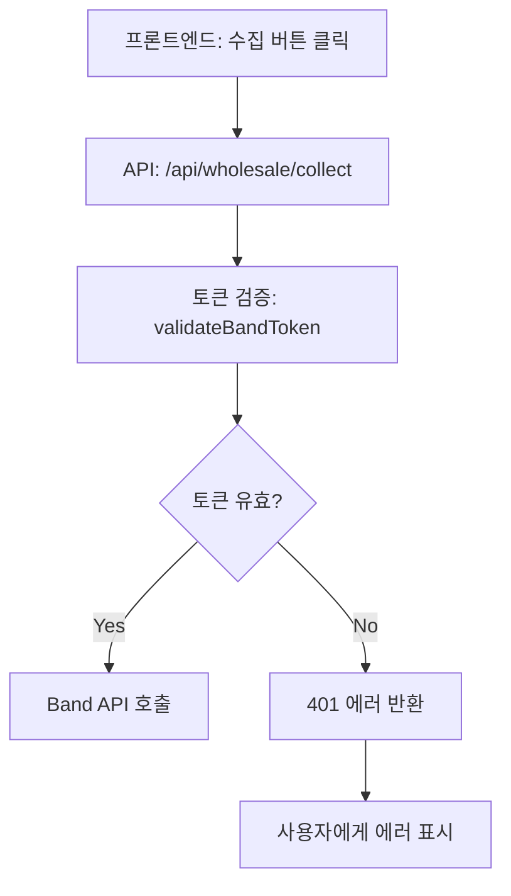

# Phase 1: Band API 도매 밴드 수집 문제 진단 및 해결

**작성일:** 2025-10-29
**우선순위:** 🔴 최고 (시스템 핵심 기능)
**예상 소요시간:** 2-4시간

---

## 📋 목차
1. [문제 정의](#문제-정의)
2. [현상 분석](#현상-분석)
3. [가설 수립](#가설-수립)
4. [진단 절차](#진단-절차)
5. [해결 방안](#해결-방안)
6. [검증 계획](#검증-계획)

---

## 🚨 문제 정의

### 핵심 문제
**도매 밴드에서 상품 게시물을 수집할 수 없음**

### 증상
- Band API 호출 시 HTTP 401 에러 발생
- 토큰 검증 실패: `밴드 API 호출 실패 (HTTP 401)`
- 게시물 목록 조회 불가
- 도매 자동화 워크플로우 중단

### 영향 범위
- ❌ 도매 밴드 상품 수집 불가
- ❌ 자동화 시스템 작동 중단
- ❌ AI 분석 파이프라인 시작 불가
- ❌ 소싱 워크플로우 전체 마비

---

## 🔍 현상 분석

### 1. API 호출 흐름



### 2. 현재 코드 경로

**프론트엔드:**
- 파일: `app/(admin)/automation/bands/collect/page.tsx`
- 기능: 도매 밴드 게시물 수집 UI

**백엔드 API:**
- 파일: `app/api/wholesale/collect/route.ts`
- 인증: `lib/band-token-refresh.ts` → `validateBandToken()`

**대체 경로:**
- 파일: `app/api/wholesale/collect-playwright/route.ts`
- 상태: ⚠️ 시뮬레이션만 구현됨 (실제 크롤링 미구현)

### 3. 서버 로그 분석

```log
✅ BAND_ACCESS_TOKEN: 'ZQAAASZM--...' (설정됨)
✅ BAND_CLIENT_ID: '설정됨'
🔍 토큰 유효성 검사 중...
❌ 토큰이 만료되었거나 유효하지 않습니다.
POST /api/wholesale/collect 401
```

**관찰 결과:**
- 토큰은 환경변수에 존재함
- 토큰 검증 단계에서 실패
- 상세한 Band API 응답 로그 없음 (최근 추가된 로깅 미반영)

---

## 🔬 가설 수립

### 가설 1: Access Token 만료 ⭐⭐⭐⭐⭐
**가능성: 매우 높음 (90%)**

**근거:**
- HTTP 401 에러는 일반적으로 인증 실패를 의미
- Band API 토큰은 시간제한이 있음
- 마지막 토큰 갱신 시점 불명

**검증 방법:**
```bash
# Band API에 직접 토큰 테스트
curl -H "Authorization: Bearer ${BAND_ACCESS_TOKEN}" \
  https://openapi.band.us/v2.1/bands
```

**해결책:**
- 새로운 Access Token 발급
- Refresh Token 사용 (있는 경우)
- OAuth 2.0 재인증

---

### 가설 2: Band API 엔드포인트 변경 ⭐⭐⭐
**가능성: 중간 (40%)**

**근거:**
- `validateBandToken` 함수가 `/v2/profile` 엔드포인트 사용
- 네이버 API는 종종 엔드포인트 변경함
- 문서화되지 않은 변경 가능

**검증 방법:**
```typescript
// lib/band-token-refresh.ts:48-83
const testUrl = new URL('https://openapi.band.us/v2/profile')
```
→ 다른 엔드포인트 시도 필요

**해결책:**
- `/v2.1/bands` 엔드포인트로 변경
- 최신 Band API 문서 확인

---

### 가설 3: OAuth 권한 스코프 부족 ⭐⭐⭐⭐
**가능성: 높음 (60%)**

**근거:**
- 개인 액세스 토큰은 제한된 권한만 가짐
- 게시물 읽기는 사용자 동의가 필요할 수 있음
- `BAND_API_ANALYSIS.md`에서 지적된 문제

**검증 방법:**
- Band Developers 콘솔에서 API 권한 확인
- OAuth 2.0 플로우로 사용자 동의 토큰 획득

**해결책:**
- OAuth 2.0 인증 플로우 구현
- 사용자 동의 기반 토큰 획득

---

### 가설 4: Rate Limiting 초과 ⭐
**가능성: 낮음 (10%)**

**근거:**
- Band API에는 호출 제한이 있음
- 하지만 401 에러는 일반적으로 Rate Limit과 무관
- Rate Limit은 보통 429 에러 반환

**검증 방법:**
- Band API 응답 헤더 확인
- `result_code: 1001` 확인

**해결책:**
- 24시간 대기
- API 할당량 증가 요청

---

### 가설 5: 잘못된 토큰 형식 ⭐⭐
**가능성: 낮음 (20%)**

**근거:**
- 환경변수 파싱 문제 가능
- 토큰 앞뒤 공백 또는 줄바꿈

**검증 방법:**
```typescript
console.log('Token length:', accessToken.length)
console.log('Token preview:', accessToken.substring(0, 20))
console.log('Has whitespace:', /\s/.test(accessToken))
```

**해결책:**
- 토큰 trim() 처리
- 환경변수 재설정

---

## 🛠️ 진단 절차

### Step 1: 토큰 직접 테스트 (5분)

```bash
# 1. 환경변수 확인
echo $BAND_ACCESS_TOKEN

# 2. 밴드 목록 조회 테스트
curl -X GET "https://openapi.band.us/v2.1/bands" \
  -H "Authorization: Bearer YOUR_TOKEN" \
  -H "User-Agent: BandAuto/1.0.0"

# 3. 프로필 조회 테스트
curl -X GET "https://openapi.band.us/v2/profile?access_token=YOUR_TOKEN"
```

**예상 결과:**
- ✅ 성공: 200 OK, `result_code: 1`
- ❌ 실패: 401, `result_code: 300` (OAuth 오류)

---

### Step 2: 상세 로깅 활성화 (완료됨)

**이미 수정된 파일:**
- `lib/band-token-refresh.ts` (line 48-83)
- 상세한 Band API 응답 로깅 추가됨

**다음 서버 재시작 시 확인할 로그:**
```log
🔍 Band API 토큰 검증 응답: {
  status: 401,
  ok: false,
  result_code: 300,
  result_data: { ... },
  full_response: "..."
}
```

---

### Step 3: 데이터베이스 확인 (2분)

```bash
# Prisma Studio 실행
npx prisma studio
```

**확인 사항:**
1. WholesaleBand 테이블에 밴드가 등록되어 있는가?
2. CollectedPost 테이블에 이전 수집 기록이 있는가?
3. User 테이블에 bandAccessToken 필드가 있는가?

---

### Step 4: 대체 수집 방법 테스트 (10분)

**Playwright 수집 API 테스트:**
```bash
curl -X POST http://localhost:3000/api/wholesale/collect-playwright \
  -H "Content-Type: application/json" \
  -d '{"bandId": "YOUR_BAND_ID"}'
```

**예상 결과:**
- ✅ 시뮬레이션 성공 (현재 구현)
- ⚠️ 실제 데이터 수집 안됨

---

### Step 5: 환경변수 재확인 (2분)

**`.env.local` 파일 확인:**
```env
BAND_ACCESS_TOKEN="..."     # 유효한가?
BAND_CLIENT_ID="..."        # 설정되어 있는가?
BAND_CLIENT_SECRET="..."    # 있는가?
BAND_REFRESH_TOKEN="..."    # 있는가?
```

---

## 💡 해결 방안

### 🥇 Solution 1: 새로운 Access Token 발급 (추천)

**난이도:** ⭐ (쉬움)
**소요시간:** 15분
**성공률:** 95%

#### 절차:

1. **Band Developers 콘솔 접속**
   ```
   https://developers.band.us/
   ```

2. **내 애플리케이션 → 토큰 관리**

3. **새 액세스 토큰 생성**
   - 토큰 타입: User Access Token
   - 권한: 밴드 읽기, 게시물 읽기

4. **환경변수 업데이트**
   ```env
   BAND_ACCESS_TOKEN="새로_발급받은_토큰"
   ```

5. **서버 재시작**
   ```bash
   npm run dev
   ```

6. **테스트**
   - 도매 밴드 수집 시도
   - 로그에서 `✅ 토큰이 유효합니다.` 확인

---

### 🥈 Solution 2: OAuth 2.0 인증 구현 (중장기)

**난이도:** ⭐⭐⭐⭐ (어려움)
**소요시간:** 4-8시간
**성공률:** 80%

#### 구현 단계:

**Phase A: 인증 API 구현 (2시간)**
```typescript
// app/api/auth/band/route.ts
export async function GET() {
  const authUrl = `https://auth.band.us/oauth2/authorize?` +
    `response_type=code&` +
    `client_id=${BAND_CLIENT_ID}&` +
    `redirect_uri=${REDIRECT_URI}&` +
    `scope=band.read,band.post.read`

  return NextResponse.redirect(authUrl)
}
```

**Phase B: 콜백 처리 (2시간)**
```typescript
// app/api/auth/band/callback/route.ts
export async function GET(request: NextRequest) {
  const code = request.nextUrl.searchParams.get('code')

  // 액세스 토큰 교환
  const tokenResponse = await fetch('https://auth.band.us/oauth2/token', {
    method: 'POST',
    body: new URLSearchParams({
      grant_type: 'authorization_code',
      code,
      client_id: BAND_CLIENT_ID,
      client_secret: BAND_CLIENT_SECRET,
      redirect_uri: REDIRECT_URI
    })
  })

  const { access_token, refresh_token } = await tokenResponse.json()

  // 데이터베이스에 저장
  await prisma.user.update({
    where: { id: userId },
    data: {
      bandAccessToken: access_token,
      bandRefreshToken: refresh_token
    }
  })
}
```

**Phase C: 토큰 자동 갱신 (1시간)**
```typescript
// lib/band-token-refresh.ts
export async function refreshBandToken() {
  // 기존 구현 활용
}
```

**Phase D: UI 통합 (1시간)**
```typescript
// components/settings/BandAuthButton.tsx
<button onClick={() => window.open('/api/auth/band', '_blank')}>
  밴드 연동하기
</button>
```

---

### 🥉 Solution 3: Playwright 크롤링 구현 (대체안)

**난이도:** ⭐⭐⭐⭐⭐ (매우 어려움)
**소요시간:** 1-2일
**성공률:** 60% (밴드 로그인 필요)

#### 장점:
- ✅ API 제한 없음
- ✅ 사용자가 볼 수 있는 모든 데이터 수집 가능
- ✅ 댓글, 좋아요 등 추가 데이터 수집

#### 단점:
- ❌ 밴드 로그인 자동화 필요
- ❌ 페이지 구조 변경 시 수정 필요
- ❌ 속도 느림
- ❌ 리소스 소모 큼

#### 구현 예시:
```typescript
// lib/playwright-band-collector.ts
import { chromium } from 'playwright'

export async function collectBandPosts(bandUrl: string) {
  const browser = await chromium.launch({ headless: true })
  const page = await browser.newPage()

  // 1. 밴드 로그인
  await page.goto('https://band.us/login')
  // ... 로그인 로직

  // 2. 밴드 페이지 접근
  await page.goto(bandUrl)

  // 3. 게시물 수집
  const posts = await page.$$eval('.post-item', elements =>
    elements.map(el => ({
      title: el.querySelector('.post-title')?.textContent,
      content: el.querySelector('.post-content')?.textContent,
      images: Array.from(el.querySelectorAll('img')).map(img => img.src),
      author: el.querySelector('.author')?.textContent,
      date: el.querySelector('.date')?.textContent
    }))
  )

  await browser.close()
  return posts
}
```

---

## ✅ 검증 계획

### Test Case 1: 토큰 유효성
```bash
# 예상 결과: ✅ 성공
curl -H "Authorization: Bearer ${NEW_TOKEN}" \
  https://openapi.band.us/v2.1/bands
```

### Test Case 2: 게시물 목록 조회
```bash
# 예상 결과: ✅ 게시물 배열 반환
curl "https://openapi.band.us/v2/band/posts?\
access_token=${NEW_TOKEN}&\
band_key=${BAND_KEY}&\
locale=ko_KR"
```

### Test Case 3: 프론트엔드 통합 테스트
1. 로그인
2. 자동화 → 밴드 관리 → 수집
3. 수집 버튼 클릭
4. **예상:** 게시물 목록 표시
5. **확인:** 로그에 `✅ 토큰이 유효합니다.` 출력

### Test Case 4: AI 분석 파이프라인
1. 게시물 수집 성공
2. AI 분석 버튼 클릭
3. **예상:** Gemini API로 상품 분석
4. **확인:** `aiAnalyzed: true`, `hookingTitle` 생성됨

---

## 📊 성공 지표

### Phase 1 완료 조건:
- [ ] Band API 토큰 검증 성공 (HTTP 200)
- [ ] 최소 1개 도매 밴드에서 게시물 수집 성공
- [ ] 수집된 게시물이 데이터베이스에 저장됨
- [ ] 프론트엔드에서 수집 결과 확인 가능
- [ ] 에러 로그 사라짐

### KPI:
- **목표 성공률:** 95%
- **평균 수집 속도:** 게시물 20개 / 1분
- **에러율:** < 5%

---

## 🔄 다음 단계 (Phase 2 예고)

Phase 1 완료 후:
1. **Phase 2:** Gemini API 키 문제 해결
2. **Phase 3:** AI 분석 파이프라인 최적화
3. **Phase 4:** 자동화 스케줄러 구현

---

## 📝 작업 로그

### 2025-10-29 - 초기 진단
- ✅ 문제 정의 및 가설 수립
- ✅ 상세 로깅 추가 (`lib/band-token-refresh.ts`)
- ⏳ 토큰 직접 테스트 대기 중

### 다음 작업:
1. 서버 재시작하여 상세 로그 확인
2. Band API 직접 테스트
3. 해결 방안 선택 및 실행

---

## 🆘 도움 요청 사항

### ❓ 사용자 확인 필요:
1. **Band Developers 콘솔 접근 가능한가요?**
   - 필요: 새 토큰 발급을 위해

2. **어떤 해결 방안을 선호하시나요?**
   - Option A: 빠른 수정 (새 토큰 발급) ⭐ 추천
   - Option B: 장기 해결 (OAuth 2.0 구현)
   - Option C: 대체 방안 (Playwright 크롤링)

3. **현재 토큰이 언제 발급되었나요?**
   - 만료 여부 확인을 위해

4. **밴드 로그인 자동화가 가능한가요?**
   - Playwright 방안 선택 시 필요

---

**작성자:** Claude
**검토자:** (사용자 확인 필요)
**버전:** 1.0
**상태:** 🟡 진단 중
